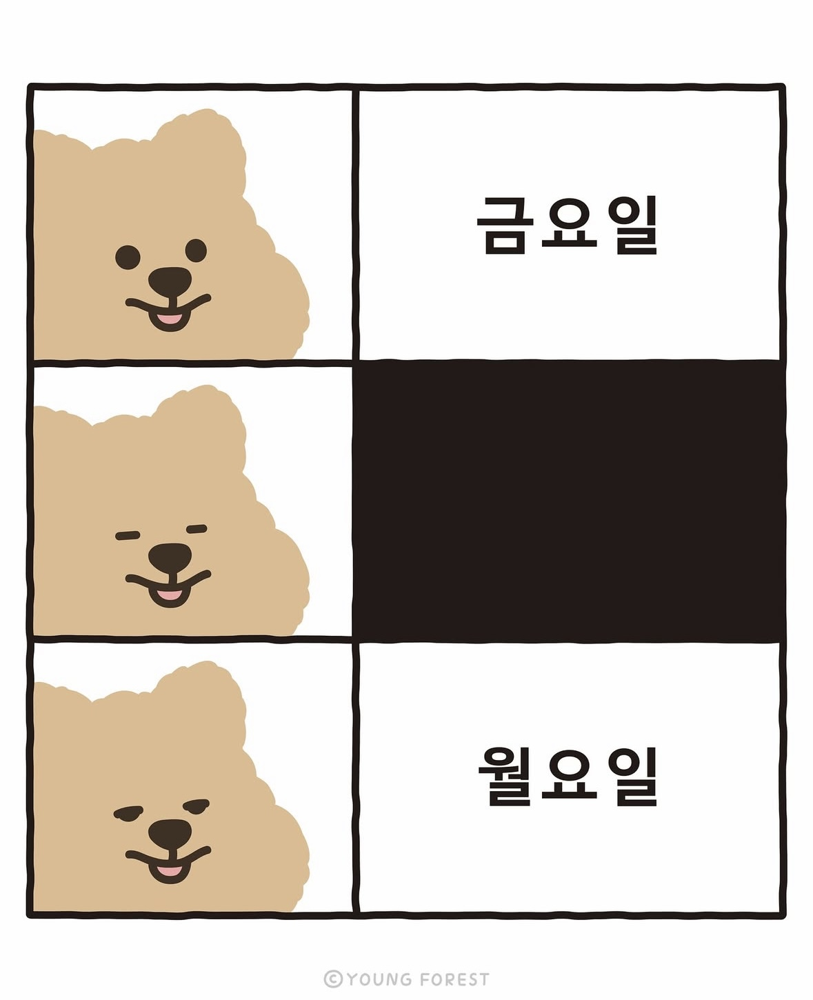

# 두 번째 회고

눈 깜빡할 사이에 프론트엔드 부트캠프를 시작한 지 벌써 **3주차** 지나가고 있다.

이렇게 빨리 시간이 흘러갔던 적이 있나 싶다.

배울수록, 공부할수록 점점 더 모르는 게 많아지는 것 같다.

같은 결과물을 내기 위해 사용하는 코드 조합이 다양하다니..

선택지가 많으니 더 막연하고 어렵게 느껴지기도 한다.

CSS 과정에 들어서며 내가 타이핑한 코드의 결과가 곧바로 화면에 나타나니 재미있고, 동기부여도 된다.

더 많은 지식을 쌓아 더 다양한 스크린을 구현해보고 싶다.

점점 더 앞으로의 과정이 기대되면서도, 걱정도 비례하여 쌓이고 있다.

이제 막 시작했는데 벌써 아침에 일어나기가 힘들어지고 있다. 그래서 짧게나마 운동을 하려고 노력 중이다.
아직은 운동과 병행하니 더 힘들지만, 체력이 곧 쌓이겠지?

오늘의 다짐

